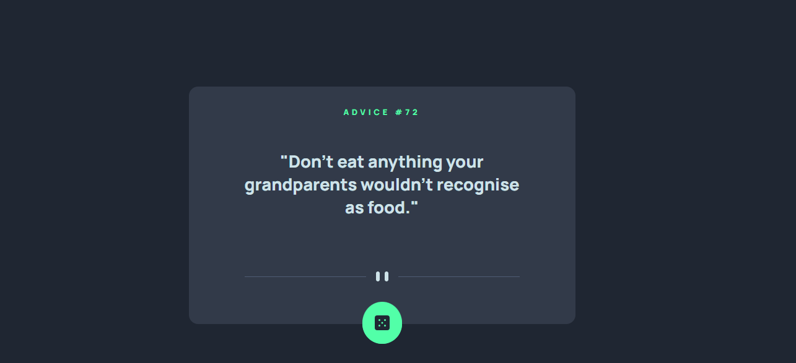

# 🎲 Advice Generator App

Gerador de conselhos aleatórios, desenvolvido como solução para o desafio **Advice Generator App** do [Frontend Mentor](https://www.frontendmentor.io/).

A aplicação consome a **Advice Slip API** para buscar conselhos aleatórios e exibi-los em uma interface simples e responsiva. Ao clicar no botão de dado, um novo conselho é buscado e exibido na tela.

---

## 📷 Preview



---

## 🚀 Demonstração

* **Live Site:** https://m1st1nh0.github.io/advice-generator-app-main/
* **Repositório:** https://github.com/m1st1nh0/advice-generator-app-main

---

## 📖 Sobre o projeto

Projeto desenvolvido para praticar conceitos fundamentais de front-end:

* Consumo de API com `fetch()`
* Programação assíncrona com `async/await`
* Manipulação do DOM
* Tratamento de erros de requisição
* Layout responsivo com Flexbox

Ao carregar a página, um conselho é buscado automaticamente. A cada clique no botão, uma nova requisição é feita à API e o conteúdo da tela é atualizado.

---

## ✨ Funcionalidades

* Busca automática de um conselho ao carregar a página
* Novo conselho a cada clique no botão
* Botão desabilitado durante a requisição, evitando cliques duplicados
* Cache desabilitado na chamada à API (`cache: "no-store"`), garantindo conselhos sempre novos
* Tratamento básico de erro de requisição
* Layout responsivo (adaptado para mobile e desktop)

---

## 🛠️ Tecnologias utilizadas

* HTML5
* CSS3 (variáveis CSS, Flexbox, media queries)
* JavaScript (ES6+)
* [Advice Slip API](https://api.adviceslip.com/)

---

## 📂 Estrutura do projeto

```
📦 advice-generator-app
├── images/
├── js/
│   └── getAdvice.js
├── index.html
├── style.css
└── README.md
```

---

## ⚙️ Como executar o projeto

Clone este repositório:

```bash
git clone https://github.com/seu-usuario/advice-generator-app.git
```

Entre na pasta do projeto:

```bash
cd advice-generator-app
```

Abra o arquivo `index.html` no navegador, ou use uma extensão como **Live Server** no VS Code.

---

## 🧠 O que aprendi

* Consumir APIs REST com `fetch()` e tratar a resposta em JSON
* Usar `async/await` para lidar com requisições assíncronas
* Atualizar o DOM dinamicamente sem recarregar a página
* Tratar erros de requisição com `try/catch`
* Evitar cliques duplicados desabilitando o botão durante o carregamento
* Usar variáveis CSS (`:root`) para manter consistência visual
* Centralizar elementos com Flexbox e posicionamento absoluto (botão flutuante)

---

## 💡 Melhorias futuras

* Exibir um indicador visual de carregamento (loading) enquanto busca o conselho
* Adicionar transição suave entre a troca de conselhos
* Exibir mensagem de erro também no título, não só no corpo do conselho
* Revisar as fontes importadas no `<head>` e manter apenas as realmente usadas no CSS
* Melhorar acessibilidade (aria-label no botão, foco visível, leitura por teclado)

---

## 🎯 Desafio

Projeto desenvolvido como parte dos desafios do **Frontend Mentor**, com foco em consumo de API e manipulação do DOM em JavaScript puro (vanilla JS).

---

## 👨‍💻 Autor

**Lucas Matheus**

* GitHub: [m1st1nh0](https://github.com/m1st1nh0)
* LinkedIn: [lucas-schamposki](https://linkedin.com/in/lucas-schamposki)

---

### Obrigado por visitar este projeto! 🚀